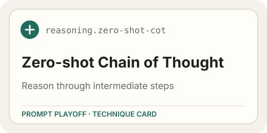
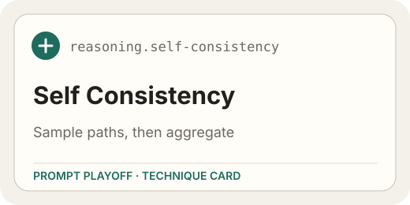
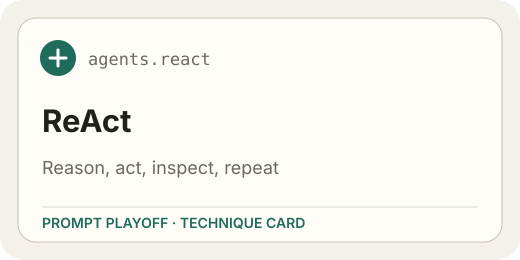
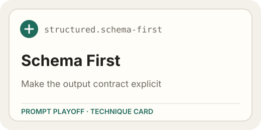
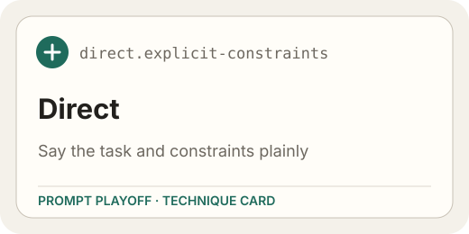
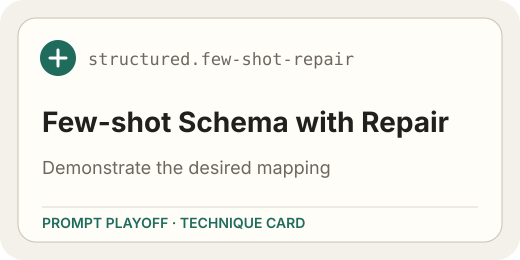
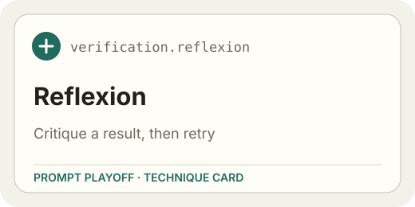
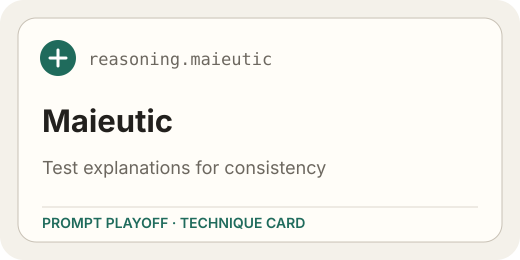
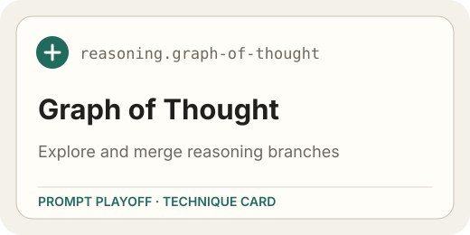

# Prompt Playoff — Prompt Optimization and Benchmarking for Local LLMs

Prompt optimization and LLM evaluation for local LLMs: picks the prompting technique your task needs, compiles the prompt it implies, measures it on your model, and searches for a better one.

```bash
# macOS / Linux
git clone https://github.com/KazKozDev/prompt-playoff.git && cd prompt-playoff && ./start.command

# Windows (PowerShell or cmd, after cloning)
git clone https://github.com/KazKozDev/prompt-playoff.git
cd prompt-playoff
start.bat
```

<p align="center">
  <a href="start.command"></a>
  <a href="start.bat"></a>
  <a href="start.command"></a>
</p>

<p align="center">Launchers after clone — double-click <code>start.command</code> on macOS, run it from a Linux shell, or use <code>start.bat</code> on Windows.</p>

<p align="center">
  
</p>

---

## Quick start

1. Run the command above. On macOS and Linux it clones the repository and starts the launcher; on Windows, clone first, then double-click `start.bat`. The launcher creates `venv`, installs the Python dependencies, checks Ollama and the required local models, starts Prompt Playoff at `http://localhost:8000`, and opens it in your browser.

2. Keep Ollama running with at least one local model. Selection and compilation work without one; only measurement needs it.

3. Describe the task, read the ranking, then measure the winner instead of trusting it:

   ```text
   → 1 DESCRIBE → 2 RECOMMEND → 3 COMPILE → 4 BENCHMARK → OPTIMIZE
   ```

   **DESCRIBE** parses your task. **RECOMMEND** ranks techniques. **COMPILE** builds the prompt. **BENCHMARK** measures on your model. **OPTIMIZE** searches for better variants.

## Optimize prompts for your local LLM

Choose the task type, describe what you need, and let Prompt Playoff pick the best technique.

```text
Task type:      structured_extraction, summarization, classification, reasoning
Input:          plain language description
Output:         ranked techniques, compiled prompt, measured quality
```

Chain-of-thought, self-consistency, ReAct, schema-first extraction and 57 more — ranked on your data, not on a blog post's opinion.

Click **→ 1 DESCRIBE** to parse your task. **→ 2 RECOMMEND** ranks techniques with reasons. **→ 3 COMPILE** builds the actual prompt. **→ 4 BENCHMARK** measures quality and reliability on your Ollama model.

The optimization is saved locally, so you can revisit it later. A full benchmark can take minutes to hours depending on dataset size and model speed.

## Sixty-one prompting techniques out of the box

Prompt Playoff ships with techniques from research papers, ready to use. Click a thumbnail for the full technique card.

<table>
  <tr>
    <td align="center"><a href="docs/techniques.md#zero-shot-chain-of-thought"></a><br><code>reasoning.zero-shot-cot</code></td>
    <td align="center"><a href="docs/techniques.md#self-consistency-sampling"></a><br><code>reasoning.self-consistency</code></td>
    <td align="center"><a href="docs/techniques.md#react-tool-loop"></a><br><code>agents.react</code></td>
  </tr>
  <tr>
    <td align="center"><a href="docs/techniques.md#schema-first-output"></a><br><code>structured.schema-first</code></td>
    <td align="center"><a href="docs/techniques.md#direct-prompting-with-explicit-constraints"></a><br><code>direct.explicit-constraints</code></td>
    <td align="center"><a href="docs/techniques.md#few-shot-schema-with-repair"></a><br><code>structured.few-shot-repair</code></td>
  </tr>
  <tr>
    <td align="center"><a href="docs/techniques.md#reflexion"></a><br><code>verification.reflexion</code></td>
    <td align="center"><a href="docs/techniques.md#maieutic-prompting"></a><br><code>reasoning.maieutic</code></td>
    <td align="center"><a href="docs/techniques.md#graph-of-thoughts"></a><br><code>reasoning.graph-of-thought</code></td>
  </tr>
</table>

## Use with business catalogue datasets

After describing the task, click **→ BENCHMARK**. Prompt Playoff loads the matching business dataset from the catalogue.

```text
Support desk:    classify support tickets
Invoice reader:  extract fields from invoices
Legal reasoning: reason about contract clauses
```

Review the dataset before starting the benchmark: check the input format, verify the expected output, and ensure the grader matches your use case.

- `business-catalogue` tag marks all business datasets
- Each dataset has input/expected/graders structure
- Benchmark graders are deterministic and include exact_match, contains_all, field_f1, chrF, JSON validity, and task-specific metrics

The benchmark belongs to this task and model pair. Model-assisted pairwise judging is a separate review workflow: its verdicts are recorded as review evidence and never presented as deterministic benchmark scores.

Every company case links the official publication used to document it and carries an evidence status. `verified_official` still means a self-reported company/vendor statement, not an independent audit; qualified and unverified wording stays visible. See the [case evidence policy](docs/business-cases.md) and [third-party data notices](THIRD_PARTY_NOTICES.md).

## Use the Python and HTTP interfaces

The package exports `Registry`, `Selector`, `PromptCompiler`, and task/model domain types for Python integrations. The server exposes the same workflow through `/v1`; its generated Swagger UI is available at `/docs` while the server is running. See the [HTTP API guide](docs/api.md), [architecture](docs/architecture.md), and the runnable files in [`examples/`](examples/).

## Measure prompt quality side by side

After **→ 4 BENCHMARK** finishes, open **Results**. Each technique shows quality, reliability, and detailed grades next to each other.

Proposed winners can be inspected manually, compiled into a final prompt, or optimized with DSPy backends. Optimization is restricted to the technique's structure; it cannot invent another technique.

```text
Technique → Quality → Reliability → Grades → Compile → Optimize
```

Start with the headline quality metric, inspect the compiled prompt, and measure only the top candidates. You can export the prompt directly or run optimization for incremental improvements. Prompt Playoff never replaces your chosen technique automatically.

Optional quality checks include grader agreement, sample difficulty analysis, and model variance. They are diagnostics: they do not change the ranking or prevent export.

## How it works

The CLI or browser sends your task description to the Python backend running on your computer.<br>
**DESCRIBE** parses the task type and constraints.<br>
**RECOMMEND** ranks techniques using heuristics and priors.<br>
**COMPILE** builds the actual prompt from the technique template.<br>
**BENCHMARK** runs on the dataset and computes quality metrics.<br>
SQLite saves the optimization, rankings, compiled prompts, and measurements locally.

```text
Task → Technique selection → Prompt compilation → Benchmark → Human review → Export
```

<details>
<summary>Technical architecture</summary>

### Optimization pipeline

1. **Describe** — the parser reads your task description and extracts type, constraints, and capabilities. A structured extraction task gets different priors than a reasoning task.
2. **Recommend** — the Selector scores all techniques against your task profile. Heuristics consider task type, model capabilities, and prior performance. The top 5 techniques are shown with reasons.
3. **Compile** — the PromptCompiler renders the technique template with your task description. Each technique has stages (e.g., cot has reasoning → answer) that become numbered model calls.
4. **Benchmark** — the dataset loader reads JSONL examples. The service runs each example through the compiled prompt. Deterministic graders score outputs: exact_match for classification, contains_all or field_f1 for extraction, and chrF or token overlap for summarization.
5. **Optimize** — optional DSPy backend (MIPROv2, GEPA) searches for better prompt variants. The optimizer modifies instructions and demonstrations while preserving the technique structure.

```text
User task
   ↓
Parser → TaskProfile
   ↓
Selector → ranked Techniques
   ↓
Compiler → compiled Prompt
   ↓
Benchmark → quality, reliability, grades
   ↓
SQLite + JSON export
```

### Storage and measurements

- `prompt_playoff.db` stores optimizations, task profiles, technique rankings, and measurement results.
- `benchmark-results/measurements.json` stores reusable measurement evidence;
  `benchmark-results/jobs.json`, `benchmark-results/experiments.json`, and
  `benchmark-results/business-cases.json` store job history and the business-case → prompt version
  → dataset → run lineage shown in Results.
- Quality is the headline grader's mean score (e.g., exact_match accuracy).
- Reliability measures variance across dataset subsets.
- Grades break down performance by grader (e.g., terminology, fluency, completeness).

### Important files

- `start.command` / `start.bat` — cross-platform launchers for macOS, Windows, Linux.
- `src/prompt_playoff/service.py` — core optimization service, selection, compilation, benchmarking.
- `src/prompt_playoff/selector.py` — technique ranking with heuristics and priors.
- `src/prompt_playoff/optimizer.py` — prompt optimization with native and DSPy backends.
- `src/prompt_playoff/graders.py` — the deterministic grader registry, including exact_match, contains_all, field_f1 and chrF.
- `src/prompt_playoff/business_catalog.py` — business dataset catalogue.
- `src/prompt_playoff/technique_store.py` — technique registry from YAML files.
- `src/prompt_playoff/data/techniques/` — 61 technique definitions; see the [complete catalogue](docs/techniques.md).
- `src/prompt_playoff/data/datasets/` — bundled JSONL datasets.
- `src/prompt_playoff/data/static/` — web interface HTML/CSS/JS.
- `tests/` — unit and integration tests.

</details>

<details>
<summary>Configuration</summary>

| Setting | Default | What it means |
|---|---|---|
| App address | `http://localhost:8000` | Local browser interface; set `--host` and `--port` to change |
| Ollama address | `http://localhost:11434` | Local server that runs the language models |
| Model profile | keyword parsing only | Model capabilities detected from name (e.g., `llama3.2:3b` → 3B params, instruct) |
| Dataset directory | `src/prompt_playoff/data/datasets/` | JSONL datasets for benchmarking |
| Techniques directory | `src/prompt_playoff/data/techniques/` | YAML technique definitions |
| Measurement store | `benchmark-results/measurements.json` | Reusable benchmark evidence; configurable with `PROMPT_PLAYOFF_MEASUREMENTS` |
| Engine model | unset | Model that reads descriptions, authors prompts, and proposes rewrites |
| Chunk size | dataset-defined | Examples per benchmark (typically 50-100) |
| Grader | task-dependent | Deterministic metric declared by each dataset; model judging is a separate review workflow |

</details>

<details>
<summary>Requirements</summary>

- **macOS, Windows, or Linux** for the launchers. Any platform with Python 3.11+ for manual install.
- **Ollama** running on the same computer for measurement.
- The minimum local setup is one instruct model (e.g., `llama3.2:3b`). For better discrimination, use a larger model (7B+).
- A stack that personally produced good results for the author: Benchmark `llama3.1:8b` (8B), Optimization `llama3.1:70b` (70B), Engine `qwen2.5:32b` (32B).
- Enough memory and disk space for the models you choose.
- Internet access on the first run to download Python dependencies and Ollama models.
- Optional: DSPy for advanced optimization, Hugging Face datasets for importing external corpora, Langfuse/OpenTelemetry for tracing.

The launchers use an existing Python 3.11+ installation when available. Otherwise, they install Python via `uv`.

</details>

<details>
<summary>Limitations</summary>

- Prompt Playoff is not a one-click optimizer. A good prompt needs the staged workflow (describe → recommend → compile → benchmark → optimize); expecting automatic perfection will disappoint.
- Benchmark quality depends heavily on the model. A stack that personally produced good results for the author is Benchmark `llama3.1:8b` (8B), Optimization `llama3.1:70b` (70B), Engine `qwen2.5:32b` (32B). Smaller models still run; expect less discrimination between techniques.
- A long benchmark keeps going if you close the browser tab; use the Experiments page to check progress after an interrupt or server restart. A full machine sleep or Ollama crash still stops the measurement.
- Prompt Playoff accepts JSONL datasets. External datasets must be converted to input/expected/graders format.
- Benchmarking a technique on 100 examples can take minutes to hours depending on model speed and dataset complexity.
- Technique rankings can still miss edge cases or favor techniques that match the grader rather than your actual use case. Review compiled prompts before deploying.
- Large Ollama models need substantial memory and disk space; Prompt Playoff cannot make a model fit hardware that is too small.
- Model-assisted authoring, optimization and pairwise review send the supplied content to the selected provider and may cost money.
- DSPy optimization is optional, requires additional dependencies, and may take many model calls to converge.
- Prompt Playoff does not currently provide an official Docker image.

</details>

<details>
<summary>Manual installation, Docker, development setup</summary>

### Manual installation

```bash
git clone https://github.com/KazKozDev/prompt-playoff.git
cd prompt-playoff
pip install -e '.[all]'
prompt-playoff serve
```

`prompt-playoff serve` starts the web interface at `http://localhost:8000`.

The platform launchers use the same setup:

- macOS: double-click `start.command`
- Linux: run `./start.command`
- Windows: double-click `start.bat`

To use optional integrations, copy `.env.example` to `.env` and add the provider keys.

### Docker

The repository includes a non-root [Dockerfile](Dockerfile). Build and run it with the commands in [configuration](docs/configuration.md#docker). No prebuilt official container image is published yet; pass an accessible Ollama/provider URL explicitly when the container cannot reach the host service.

### Development setup

```bash
python3 -m venv .venv
source .venv/bin/activate
pip install -e '.[dev]'
pytest tests -q
ruff check .
ruff format --check .
```

The test suite does not require Ollama, downloaded models, or network access.

</details>

## License

Prompt Playoff source code is free and open-source software licensed under the [MIT License](LICENSE). Bundled benchmark samples retain their upstream licenses and are not relicensed under MIT; see [third-party data notices](THIRD_PARTY_NOTICES.md). Dataset entries without redistribution permission remain visible as source-only and are not included in the package.

<br><br>

<p align="center">
  <a href="https://github.com/KazKozDev/prompt-playoff/blob/main/LICENSE"></a>
  <a href="https://github.com/KazKozDev/prompt-playoff/actions/workflows/ci.yml"></a>
  <a href="https://www.python.org/"></a>
  <a href="https://ollama.ai/"></a>
</p>

<p align="center">
  <a href="https://github.com/KazKozDev/prompt-playoff/issues">Issues</a> ·
  <a href="https://github.com/KazKozDev/prompt-playoff/blob/main/CHANGELOG.md">Changelog</a> ·
  <a href="https://github.com/KazKozDev/prompt-playoff/blob/main/CONTRIBUTING.md">Contributing</a> ·
  <a href="https://github.com/KazKozDev/prompt-playoff/blob/main/LICENSE">LICENSE</a> ·
  <a href="https://github.com/KazKozDev/prompt-playoff/blob/main/docs/architecture.md">Architecture</a> ·
  <a href="docs/api.md">API</a> ·
  <a href="docs/releasing.md">Releasing</a> ·
  <a href="https://www.linkedin.com/in/kazkozdev/">LinkedIn</a>
</p>
