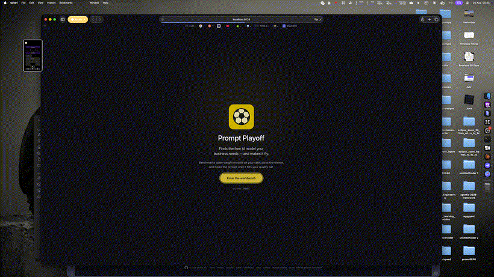

# How to record a new demo GIF

## Prerequisites

- **ffmpeg**: `brew install ffmpeg` (macOS) or `sudo apt install ffmpeg` (Linux)
- **QuickTime Player** (macOS) or **OBS Studio** (cross-platform)
- Running Ollama instance with at least one model

## Steps

### 1. Start Prompt Playoff

```bash
./start.command
# or
python -m prompt_playoff serve --port 8000
```

Wait for the server to start and open http://localhost:8000 in your browser.

### 2. Record your screen

**macOS (QuickTime Player):**
1. Open QuickTime Player
2. File → New Screen Recording
3. Click Record, select the browser window
4. Perform the demo flow (see below)
5. Stop recording and save as `assets/demo-recording.mov`

**Cross-platform (OBS Studio):**
1. Open OBS Studio
2. Add Display Capture or Window Capture source
3. Start Recording
4. Perform the demo flow
5. Stop Recording and save as `assets/demo-recording.mp4`

### 3. Demo flow to record

Perform these actions smoothly and deliberately:

1. **Homepage** (2 seconds) - Show the main interface
2. **Enter task** (3 seconds) - Type: "Extract named entities from text"
3. **Select task type** (2 seconds) - Choose "structured_extraction"
4. **Click Recommend** (3 seconds) - Wait for technique rankings
5. **Review techniques** (3 seconds) - Scroll through top 3 techniques
6. **Click Compile** (3 seconds) - Show the compiled prompt
7. **Click Benchmark** (5 seconds) - Show measurement starting
8. **Results** (5 seconds) - Show quality scores and rankings

Total duration: ~25 seconds

### 4. Convert to GIF

```bash
cd /Users/artemk/projects/prompt-playoff

# Crop to browser window and resize
ffmpeg -i assets/demo-recording.mov \
    -vf "crop=1200:800:100:100,scale=820:-1:flags=lanczos" \
    -r 10 \
    -gifflags 0 \
    assets/demo-cli.gif

# Or with gifsicle for better compression
ffmpeg -i assets/demo-recording.mov \
    -vf "crop=1200:800:100:100,scale=820:-1:flags=lanczos,fps=10" \
    -f image2pipe - \
| gifsicle --optimize=3 --delay=10 --loopcount=0 - > assets/demo-cli.gif
```

### 5. Optimize file size

If the GIF is too large (>2MB):

```bash
# Reduce frame rate
ffmpeg -i assets/demo-recording.mov \
    -vf "crop=1200:800:100:100,scale=820:-1:flags=lanczos,fps=8" \
    -gifflags 0 \
    assets/demo-cli.gif

# Or reduce colors
gifsicle -O3 --colors=128 -i assets/demo-cli.gif -o assets/demo-cli.gif
```

Target file size: <2MB for GitHub

### 6. Update README

Edit `README.md` and update the demo section:

```markdown
<p align="center">
  
</p>
```

### 7. Commit and push

```bash
git add assets/demo-cli.gif README.md
git commit -m "docs: new demo GIF with updated UI"
git push origin main
```

## Tips

- **Clean browser**: Clear bookmarks bar, use incognito mode
- **Consistent lighting**: Record in good light, avoid glare
- **Smooth movements**: Move mouse deliberately, not too fast
- **Good contrast**: Use light or dark theme consistently
- **Test first**: Do a dry run before recording
- **Audio off**: Mute system sounds during recording

## Alternative: Automated screenshots

For a more controlled demo, use screenshots:

```bash
# Start server
python -m prompt_playoff serve --port 8123 &

# Take screenshots at each step
screencapture -x assets/step1-home.png
# Click Recommend
screencapture -x assets/step2-recommend.png
# Click Compile  
screencapture -x assets/step3-compile.png
# Click Benchmark
screencapture -x assets/step4-benchmark.png
# Show results
screencapture -x assets/step5-results.png

# Combine into GIF
convert -delay 100 -loop 0 assets/step*.png assets/demo-cli.gif
```
